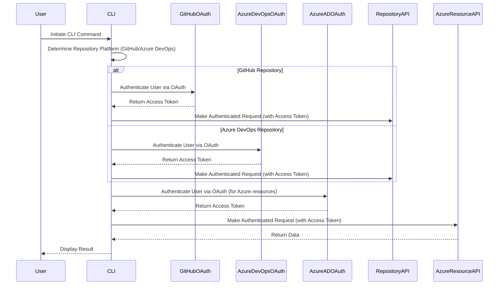

# Client Authentication and Authorization

## Overview

The authentication and authorization process for ADRFlow ensures that users are properly authenticated and authorized to access repositories and Azure resources. This process supports both GitHub and Azure DevOps for repository management, using OAuth for authentication for RBAC authorization.

## Sequence Diagram

## Steps in the Process

1. **Initiate CLI Command**:
   - The user initiates a command in the Command Line Interface (CLI).
2. **Determine Repository Platform**:
   - The CLI determines whether the repository is hosted on GitHub or Azure DevOps based on the local repository information (remote URL).
3. **Authenticate with Repository Pattern**:
   - **GitHub Repository**:
     - The CLI initiates the GitHub OAuth flow to authenticate the user.
     - GitHub returns an access token to the CLI.
     - The CLI uses the access token to make authenticated requests to the GitHub  API.
   - **Azure DevOps Repository**:
     - The CLI initiates the Azure DevOps OAuth flow to authenticate the user.
     - Azure DevOps returns an access token to the CLI.
     - The CLI uses the access token to make authenticated requests to the Azure DevOps API.
4. **Authenticate with Azure for Application Resources**
   - The CLI initiates the Azure Active Directory (AAD) OAuth flow to authenticate the user for access Azure resources.
   - Azure AD returns an access token to the CLI.
   - The CLI uses the access token to make authenticated requests to Azure Resource APIs (e.g. Cosmos DB, Azure App Configuration).
5. **Authorization with RBAC**:
   - For repository access, the CLI CLI enforces RBAC based on the user's role in GitHub or Azure DevOPs.
   - For Azure resources, the CLI enforces RBAC based on the user's role in Microsoft Entra ID.
   - The CLI makes authenticated requests to the respective APIs (Repository API, Azure Resource API) based on the user's permissions.
6. **Return Data**:
   - The respective API (Repository API, Azure Resource API) returns the requested data to the CLI.
   - The CLI displays the result to the user.

## Conclusion

The **Client Authentication and Authorization** process for ADRFlow ensures secure access to repositories and Azure resources. By leveraging OAuth for authentication and RBAC for authorization, ADRFlow provides a consistent and scalable approach to managing user permissions across GitHub, Azure DevOps, and Azure. This process flow enables user to seamlessly interact with ADRFlow while ensuring that access controls are enforced based on their roles.