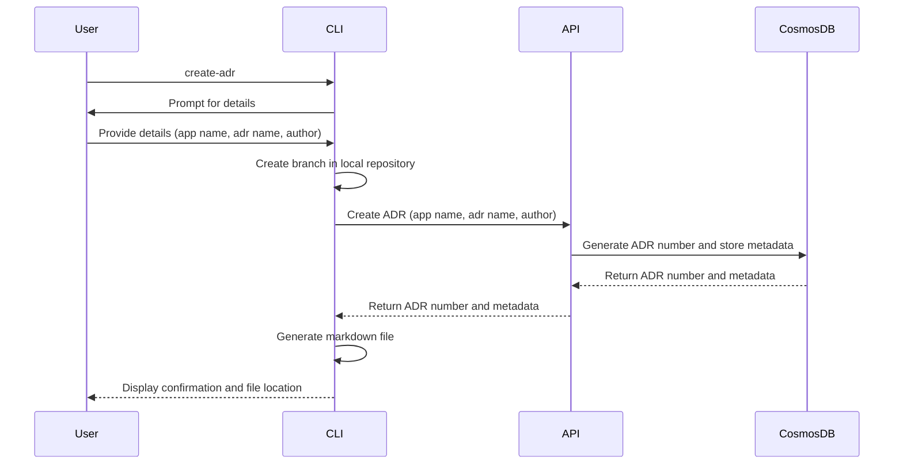

# Create ADR

## Overview

The Create ADR process in **ADRFlow** is designed to streamline the creation of Architecture Decision Records (ADRs) by automating the generation of unique identifiers, populating initial metadata, and creating the markdown document. This process ensures consistency and efficiency while integrating seamlessly with users' local repositories and the central database.

## Sequence Diagram

## Steps in the Process

1. **Initiate Creation**:
   - **User Input**: The user initiates the process by running the `create-adr` command in the Command Line Interface (CLI).
   - **Details**: The CLI prompts the user to provide essential details: application/microservice name, ADR name, and author name.
2. **Create Branch**:
   - **Branch Creation**: The CLI creates a new branch in the target application/microservice repository on the local machine. The branch could follow a convention such as `adr/<adr_number>_<adr_name>`.

> [!NOTE]
>
> The branch creation process is based on the current working directory where the CLI command is executed.

3. **Generate ADR Number**:

- **API Call**: The CLI sends a request to the `Create ADR` API endpoint, passing the provided details.
- **Metadata Generation**: The API generates a unique ADR number and creates initial metadata.
- **API Response**: The API responds to the CLI with the ADR number and initial metadata.

1. **Create Markdown File**:
   - **Template Usage**: The CLI generates the initial ADR markdown document using a predefined template.
   - **Populate Content**: The CLI populates the markdown document with the ADR number,AR name, author name, initial status (Proposed), and other metadata.
   - **Save File**: The CLI saves the markdown file in the local repository.
2. **Store Metadata**:
   - **Database Update**: The API stores the initial ADR metadata in Azure Cosmos DB Gremlin, including the status history and relationships.
3. **Output**:
   - **Confirmation**: The CLI confirms the successful creation of the ADR and displays the location of the markdown file to the user.

## Component Interactions

- **Command Line Interface (CLI)**:
  - Initiates the create ADR process by collecting necessary details from the user.
  - Creates a new branch in the local repository.
  - Interacts with the `Create ADR` API endpoints to generate an ADR number and receive initial metadata.
  - Generates and saves the ADR markdown document in the new branch of the local repository.
  - Displays a confirmation message to the user.
- **API**:
  - Receives requests from the CLI to create a new ADR.
  - Generates a unique ADR number and creates initial metadata.
  - Stores the ADR metadata in Azure Cosmos DB Gremlin.
  - Returns the ADR number and metadata to the CLI.
- **Azure Cosmos DB Gremlin**:
  - Sores the ADR metadata, including relationships and status history, to ensure traceability and relationship analysis.
  - Provides confirmation of storage to the API.

## Conclusion

The **Create ADR** process in **ADRFlow** is designed to be straightforward and efficient, leveraging a combination of CLI and API interactions. By automating key steps, such as generating unique ADR number and populating initial metadata, ADRFlow ensures consistency and reduces the effort required to create and manage ADRs. This process provides a solid foundation for managing architectural decisions, enabling teams to focus on the content and quality of their decisions rather than the mechanics of record-keeping.

By following this process, users can quickly and easily create new ADRs, ensuring that their architectural decisions are well-documented, traceable, and integrated into their local repositories. The flexibility of the API-based approach allows for future expansion, including the potential addition of web and desktop interfaces.