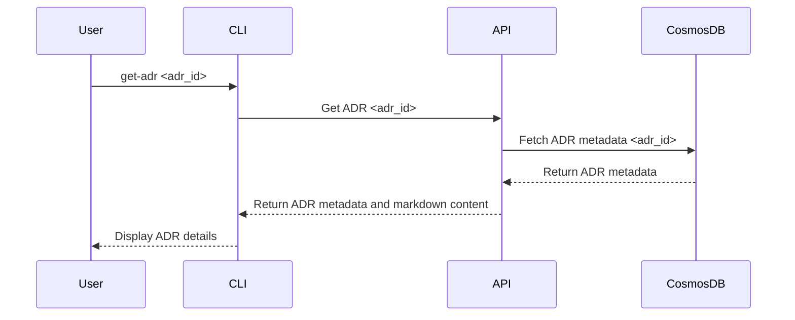

# Get ADR Details

The **Get ADR Details** process in **ADRFlow** allows users to retrieve detailed information about a specific Architecture Decision Record (ADR). This process fetches metadata, status history, and markdown content for the ADR, providing a comprehensive view of the decision.

## Sequence Diagram

## Steps in the Process

1. **Initiate Retrieval**:
   - **User Input**: The user initiates the process by running the `get-adr` command in the Command Line Interface (CLI).
   - **ADR Id**: The user provides the ADR identifier as input.
2. **Retrieve Metadata**:
   - **API Call**: The CLI sends a request to the `Get ADR` API endpoint with the provided ADR Id.
   - **Database Query**: The API retrieves the ADR metadata from Azure Cosmos DB Gremlin.
3. **Fetch Markdown Content**:
   - **Optional**: The API fetches the markdown content from the stored location (e.g., a file repository or a version control system).
4. **Return Details**:
   - **API Response**: The API responds to the CLI with the retrieved ADR metadata and markdown content.
5. **Display Metadata**:
   - **Output**: The CLI displays the detailed ADR information, including metadata, status history, and markdown content, to the user.

## Component Interactions

- **Command Line Interface (CLI)**:
  - Initiates the get ADR details process by accepting the ADR ID from the user.
  - Sends a request to the `Get ADR` API endpoint to retrieve ADR details.
  - Displays the retrieved information to the user.
- **API**:
  - Receives requests from the CLI to get ADR details.
  - Fetches the ADR metadata from Azure Cosmos DB Gremlin.
  - Fetches the markdown content from the stored location.
  - Responds to the CLI with the retrieved ADR details.
- **Azure Cosmos DB Gremlin**:
  - Stores the ADR metadata and status history.
  - Provides the metadata when queried by the API.

## Conclusion

The **Get ADR Details** process in ADRFlow ensures that users can easily access detailed information about specific ADRs. By fetching metadata and markdown content from the central database, users gain a comprehensive view of the architectural decisions, including their context, status history, and content. This process facilitates better understanding and traceability of decisions, supporting effective collaboration and decision-making within the team.