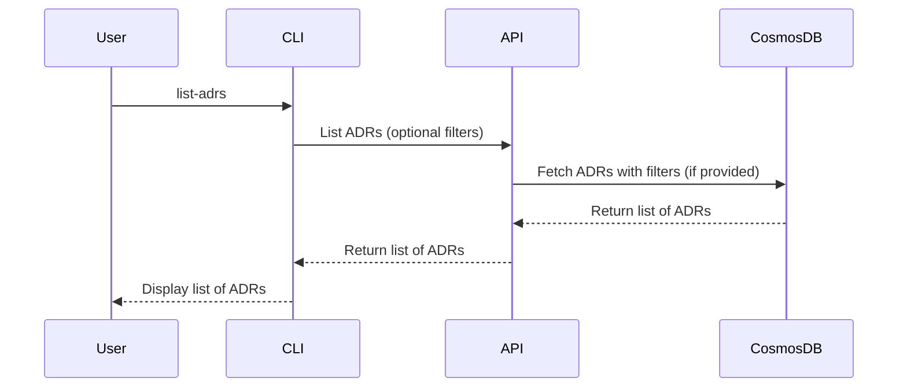

# List ADRs

## Overview

The **List ADRs** process in **ADRFlow** allows users to retrieve a list of Architecture Records (ADRs) based on various criteria such as status, date, author, or application/microservice. This process provides a comprehensive view of available ADRs, facilitating quick access and efficient management.

## Sequence Diagram

## Steps in the Process

1. **Initiate Listing**:
   - **User Input**: The user initiates the process by running the `list-adrs` command in the Command Line Interface (CLI).
   - **Optional Filters**: The user can provide optional filters such as status, date, author, or application/microservice.
2. **Retrieve ADRs**:
   - **API Call**: The CLI sends a request to the `List ADRs` API endpoint, passing the optional filters if provided.
   - **Database Query**: The API queries Azure Cosmos DB Gremlin to fetch ADRs that match the provided filters.
3. **Return ADRs**:
   - **API Response**: The API responds to the CLI with the list of ADRs that match the criteria.
4. **Display ADRs**: The CLI displays the list of ADRs, providing brief summaries for each ADR.

## Component Interactions

- **Command Line Interface (CLI)**:
  - Initiates the list ADRs process by accepting optional filters from the user.
  - Sends a request to the `List ADRs` API endpoint to retrieve ADRs based on the provided criteria.
  - Displays the list of ADRs to the user.
- **API**:
  - Receives requests from the CLI to list ADRs.
  - Queries Azure Cosmos DB Gremlin to fetch ADRs, that match the provided filters.
  - Responds to the CLI with the list of ADRs.
- **Azure Cosmos DB Gremlin**:
  - Stores ADR metadata, including status, date, author, and application/microservice information.
  - Provides the list of ADRs when queried by the API, applying any filters if specified.

## Conclusion

The **List ADRs** process in **ADRFlow** enable users to efficiently retrieve and view a list of Architecture Decision Records based on various criteria. By querying the central database and applying optional filters, user can quickly access the ADRs relevant to their needs. This process enhances the manageability and accessibility of ADRs, supporting better decision-making and organization with the team.