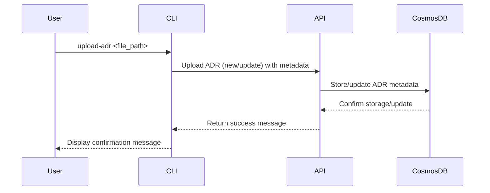

# Upload ADR

## Overview

The **Upload ADR** process in **ADRFlow** allows users to upload newly created ADRs or update existing ADRs. This process ensures that any changes or new additions are synchronized with the central database, maintaining up-to-date and accurate records.

## Sequence Diagram

## Steps in the Process

1. **Initiate Upload**
   - **User Input**: The user initiates the process by running the `upload-adr` command in the Command Line Interface (CLI).
   - **File Path**: The user provides the file path of the ADR markdown document.
2. **Extract Metadata**:
   - **Metadata Extraction**: The CLI extracts metadata from the provided markdown document, such as ADR ID, title, status, date, author, and content.
3. **Determine Action**:
   - **New or Update**: The CLI checks if the ADR is new or an updated based on the ADR Id.
     - **New ADR**: If the ADR ID does not exist in the database, it is treated as a new ADRs.
     - **Update ADR**: If the ADR ID exists, it is treated as an update to an existing ADR.
4. **Upload Metadata**:
   - **API Call**: The CLI sends a request to the `Upload ADR` API endpoint, including the extracted metadata and content.
   - **Store Metadata**: The API stores the new ADR metadata or updates the existing ADR metadata in Azure Cosmos DB Gremlin.
5. **Return Confirmation**:
   - **Command Line Interface (CLI)**:
     - Initiates the upload ADR process by accessing the file path from the user.
     - Extracts metadata fromt he provided markdown document.
     - Determines if the ADR is new or an updated based on the ADR ID.
     - Sends a request to the `upload ADR` API endpoint to store or update the ADR metadata.
     - Displays a confirmation message to the user.
   - **API**: